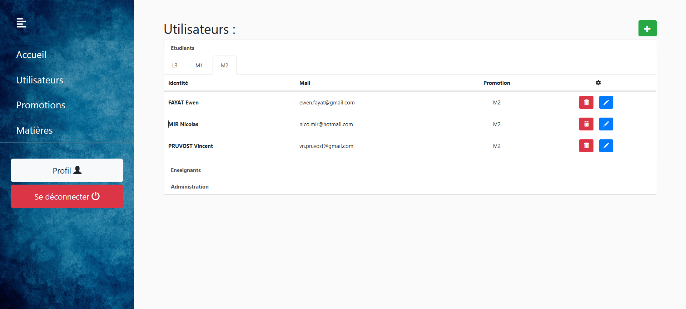

# ProGestion
Projet de M2 - Gestion des projets SOA

Etudiant : 
* Yann Bourgues
* Ewen Fayat  
* Nicolas MIR

## Présentation du projet :  
Ce projet consiste à mettre en place une application qui permettra à un enseignant de gérer les projets de sa matière.

Existant :
* None

Fonctionnalités faites :
* Gestion des ressources de l'application [Admin]
* Inscription étudiante [Etudiant]
* Création de projet [Etudiant, Enseignant]
* Suppression de projet [Enseignant]
* Modification de projet [Enseignant, Etudiant]
* Création groupe projet [Etudiant]

 Un administrateur créé les enseignants qui auront accès à l'application, il peut gérer les utilisateurs.
 Il peut créer aussi des promotions, des matières.
 
 Un enseignant peut créer des projets dit "initiative enseignante", il peut valider des projets dit "initiative étudiante".
 
 Un étudiant peut s'inscrire sur un projet existant et il a la possibilité d'en créer un.

## Architecture

Ci-après le schéma de la base de données : 
  

## Maquette des écrans

Ci-après la maquette de la connexion : 
  

Ci-après la maquette de la gestion des users : 
  

