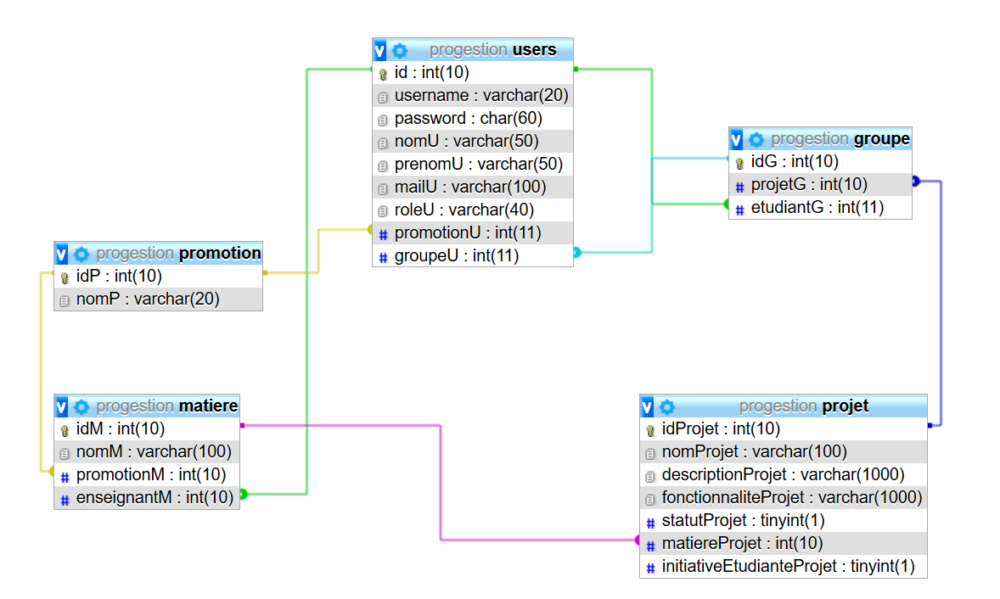

# Bienvenue sur la doc d'installation et d'utilisation de l'application Progestion

## Définition des besoins

Ce projet consiste à mettre en place une application qui permettra à un enseignant de gérer les projets de sa matière.
La dématérialisation de ce processus permettra à l'enseignant de gagner du temps dans le déroulé de sa matère.

## Liste des fonctionnalités

* Création des ressources [Admin]
* Gestion des ressources de l'application [Admin]
* Inscription étudiante [Etudiant]
* Création de projet [Etudiant, Enseignant]
* Suppression de projet [Enseignant]
* Modification de projet [Enseignant, Etudiant]
* Création groupe projet [Etudiant]

## Architecture

Ci-après le schéma de la base de données : 
  

## Maquette des écrans

Ci-après la maquette de la connexion : 
  

Ci-après la maquette de la gestion des users : 
  

Ci-après la maquette de la gestion des projets par l'enseignant : 
  

Ci-après la maquette de la gestion des projets par l'étudiant : 
  

## Descriptions des champs

## Tableau des messages d'erreurs
